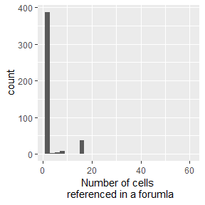

Tidal Spreadsheet fun
================

read in spreadsheet with tidyxl

``` r
library(readr)
library(readxl)
library(tidyxl)
library(unpivotr)
library(tidyverse)
library(sparkline)
```

``` r
# TODO Start with basic read in of spreadsheet and extracting the proper cells.
sheet <- "spreadsheets/Copy of Culvert37.xlsm" 
# Tidy up the sheets. 
# Selecting SUMMARY sheet here.
cells <- xlsx_cells(sheet) %>% 
  filter(is_blank == FALSE, sheet != "Data Sheet - BLANK") 
  
cells
```

    ## # A tibble: 1,162 x 21
    ##    sheet      address   row   col is_blank data_type error logical numeric
    ##    <chr>      <chr>   <int> <int> <lgl>    <chr>     <chr> <lgl>     <dbl>
    ##  1 Data Shee~ A1          1     1 FALSE    character <NA>  NA          NA 
    ##  2 Data Shee~ A5          5     1 FALSE    character <NA>  NA          NA 
    ##  3 Data Shee~ G7          7     7 FALSE    character <NA>  NA          NA 
    ##  4 Data Shee~ L7          7    12 FALSE    numeric   <NA>  NA          37.
    ##  5 Data Shee~ A9          9     1 FALSE    character <NA>  NA          NA 
    ##  6 Data Shee~ G9          9     7 FALSE    character <NA>  NA          NA 
    ##  7 Data Shee~ V9          9    22 FALSE    character <NA>  NA          NA 
    ##  8 Data Shee~ Z9          9    26 FALSE    date      <NA>  NA          NA 
    ##  9 Data Shee~ V10        10    22 FALSE    character <NA>  NA          NA 
    ## 10 Data Shee~ Z10        10    26 FALSE    date      <NA>  NA          NA 
    ## # ... with 1,152 more rows, and 12 more variables: date <dttm>,
    ## #   character <chr>, character_formatted <list>, formula <chr>,
    ## #   is_array <lgl>, formula_ref <chr>, formula_group <int>, comment <chr>,
    ## #   height <dbl>, width <dbl>, style_format <chr>, local_format_id <int>

Characters (aka Potential Keys):
--------------------------------

Below (and in extractedKey.xlsx) are extracted *character* values with their associated cell address.
**NOTE:** Some of these cells may in fact be data values and not keys.

``` r
characters <- cells[cells$data_type == "character", c("sheet", "address", "character")]

characters
```

    ## # A tibble: 691 x 3
    ##    sheet             address character                                    
    ##    <chr>             <chr>   <chr>                                        
    ##  1 Data Sheet - SITE A1      "New Hampshire’s Tidal Crossing Assessment P~
    ##  2 Data Sheet - SITE A5      SITE VISIT DETAILS (field assessment)        
    ##  3 Data Sheet - SITE G7      Crossing ID:                                 
    ##  4 Data Sheet - SITE A9      Observer(s) & Organization:                  
    ##  5 Data Sheet - SITE G9      Matthew Grasso, Matthew Hamilton             
    ##  6 Data Sheet - SITE V9      Date:                                        
    ##  7 Data Sheet - SITE V10     Start Time:                                  
    ##  8 Data Sheet - SITE A11     Municipality:                                
    ##  9 Data Sheet - SITE G11     Shelter Island                               
    ## 10 Data Sheet - SITE V11     End Time:                                    
    ## # ... with 681 more rows

Numerics (aka Potential Values):
--------------------------------

Similar to the characters above, these are assumed to be data values but some could in fact be keys.

``` r
numerics <- cells[cells$data_type == "numeric", c("sheet", "address", "numeric")]

numerics
```

    ## # A tibble: 440 x 3
    ##    sheet             address numeric
    ##    <chr>             <chr>     <dbl>
    ##  1 Data Sheet - SITE L7       37.0  
    ##  2 Data Sheet - SITE AA14      2.15 
    ##  3 Data Sheet - SITE AE14      0.760
    ##  4 Data Sheet - SITE E46       1.00 
    ##  5 Data Sheet - SITE I46       1.00 
    ##  6 Data Sheet - SITE Y48       0.700
    ##  7 Data Sheet - SITE AC48      2.00 
    ##  8 Data Sheet - SITE A49       5.00 
    ##  9 Data Sheet - SITE Y49       1.10 
    ## 10 Data Sheet - SITE AC49      1.45 
    ## # ... with 430 more rows

Functions/Formulas:
-------------------

Where are the formulas? And what do they do?

``` r
formulas <- cells %>% filter(!is.na(formula)) %>% select(sheet, address, formula)

formulas %>% head(5)
```

    ## # A tibble: 5 x 3
    ##   sheet                address formula               
    ##   <chr>                <chr>   <chr>                 
    ## 1 Data Sheet - SITE    Z154    U260                  
    ## 2 Data Sheet - SITE    AE154   Z260                  
    ## 3 Data Sheet - SUMMARY G4      'Data Sheet - SITE'!G7
    ## 4 Data Sheet - SUMMARY A5      'Data Sheet - SITE'!A9
    ## 5 Data Sheet - SUMMARY V5      'Data Sheet - SITE'!V9

Slice into these formulas
-------------------------

If we need to extract some values or explore what a formula is doing we can use xlex by passing the row of interest to the function yielding a dataframe.

``` r
# Finding constants within formulas:
# directly from : https://nacnudus.github.io/tidyxl/articles/smells.html

tokens <-
  cells %>%
  filter(!is.na(formula)) %>% # filter out rows that don't contain a formula
  select(sheet, address, row, col, formula) %>% 
  mutate(tok = map(formula, xlex))  # using map make a colum containing a dataframe with the information from xlex()
  # select(-formula)

constants <- tokens %>% 
  unnest(tok) %>% 
  filter(type %in% c("error", "bool", "number", "text"))

constants %>%
  count(token, sort = TRUE) %>%
  print(n = Inf)
```

    ## # A tibble: 27 x 2
    ##    token        n
    ##    <chr>    <int>
    ##  1 0           81
    ##  2 3           66
    ##  3 5           56
    ##  4 2           55
    ##  5 1           54
    ##  6 "\"\""      51
    ##  7 4           45
    ##  8 "\"D\""     35
    ##  9 "\"R\""     35
    ## 10 "\"U\""     35
    ## 11 1.5          8
    ## 12 TRUE         6
    ## 13 "\"=2\""     5
    ## 14 "\"=3\""     5
    ## 15 "\"=4\""     5
    ## 16 1.2          4
    ## 17 10           4
    ## 18 12           4
    ## 19 13           4
    ## 20 2.3          4
    ## 21 6            4
    ## 22 "\"=5\""     3
    ## 23 0.5          2
    ## 24 0.9          2
    ## 25 0.7          1
    ## 26 0.8          1
    ## 27 100          1

``` r
reffinder <- function(tokencol){
  refNu <- tokencol %>% as.data.frame() %>% 
    group_by(type) %>% tally() %>% 
    filter(type == "ref") %>% pluck(2)
  return(refNu)
}

references <- tokens %>% 
  mutate(cellrefs = map_int(.x = tok, .f = reffinder)) %>%  # Create cellrefs to hold the number of cells a formula references.
  arrange(desc(cellrefs))
references %>% head(10)
```

    ## # A tibble: 10 x 7
    ##    sheet                address   row   col formula         tok   cellrefs
    ##    <chr>                <chr>   <int> <int> <chr>           <lis>    <int>
    ##  1 Data Sheet - SUMMARY N33        33    14 IF(N26>P26,IF(~ <tib~       60
    ##  2 Data Sheet - SUMMARY N31        31    14 IF(N26>P26,IF(~ <tib~       22
    ##  3 Data Sheet - SUMMARY N32        32    14 IF(AND(N17<=2,~ <tib~       17
    ##  4 Data Sheet - SUMMARY X62        62    24 "IF(AG62 = \"R~ <tib~       17
    ##  5 Data Sheet - SUMMARY X63        63    24 "IF(AG63 = \"R~ <tib~       17
    ##  6 Data Sheet - SUMMARY X64        64    24 "IF(AG64 = \"R~ <tib~       17
    ##  7 Data Sheet - SUMMARY X65        65    24 "IF(AG65 = \"R~ <tib~       17
    ##  8 Data Sheet - SUMMARY X66        66    24 "IF(AG66 = \"R~ <tib~       17
    ##  9 Data Sheet - SUMMARY X67        67    24 "IF(AG67 = \"R~ <tib~       17
    ## 10 Data Sheet - SUMMARY X68        68    24 "IF(AG68 = \"R~ <tib~       17

``` r
# xlsx::write.xlsx(characters,
#                  file = "spreadsheets/extractedKey.xlsx",
#                  sheetName = "Likely keys")
# xlsx::write.xlsx(numerics,
#                  file = "spreadsheets/extractedKey.xlsx",
#                  sheetName = "Likely values", append = TRUE)
# references %>% select(-tok) %>% xlsx::write.xlsx(
#                  file = "spreadsheets/extractedKey.xlsx",
#                  sheetName = "formulaKey", append = TRUE)
```

Yikes! On a few of these...

Next steps...
-------------

Seems as though there are 2 approaches we can take:

-   Extract the RAW values from the **Data Sheet - SITE** sheet and perform the various calculations/lookups/joins etc using R or other (Python?, ArcMap?) to effectively recreate the **Data Sheet - SUMMARY** sheet.

#### Pros

-   More freedom and flexibility of up and down stream data management/analysis approaches, not limited to embedded excel formulas
-   If any sensitivity analysis or altrerations to the prioritization calculations are to be explored those calculations can easily be altered; whereas now they exist in each individual excel file.
-   At least in R, we can quickly find missing information from the 'raw' data sheet. Currently some formulas just yield more or less useless errors and are imported into R as '\#Div/O!'

#### Cons

-   Will require a *fair amount* of work recoding Excel formulas into R code (or other) \*\* as mentioned above though most of the formulas are simple, single cell references, many even referencing cells that reference cells, that..etc. In fact of the 443 cells that contain some sort of formula only 139 of the cells contain references to more than one cell. And only a small proportion reference many cells (i.e. a bit messier / time consuming to dig into)



-   *OR* Just focus on extracting the values of interest, most of which are in the **Data Sheet - SUMMARY** tab.

#### Pros

-   It might be less work, but not clear how much less... Potentially not a huge amount less.

#### Cons

Pretty much covered by my Pros list above for the oher tactic.

### Potential pifalls

There's a few issues (potential) that I've come across.

-   cells are merged which makes it hard to determine which cell actually contains the value of interest.
-   There are values that are selected using a formated control (like a dropdown) which can be very easily altered.
-   accessing these values is best done through the *Data Sheet - SUMMARY* tab.
-   There appear to be cells with just spaces possibly? They are showing up as blank, but NOT empty. Unsure if this is an issue.

TO DOs:
-------

-   Using a completed (and backed up) datasheet comb through the *spreadsheets/extractedKey\_WORKING.xlsx* file to match data keys with data values.

-   **VERY IMPORTANT** work only in the 'extractedKey\_WORKING' file. The other file will/can be overwritten.

-   Once this new master lookup/key is build here's the game plan.
-   Create lookup in R using key-value pairs built from the extractedKey file
-   within this lookup retain the 'expected keys' in a colum to act as an error catcher on data extractions later.
-   Need to extract lookup tables in Lookup tab to form joins to link data value with data description (7 = Riprap under the Wingwall Materials dropdown.)

``` r
# Helper function to look up values in a cell of interest.
# 

get.cell.value <- function(tidysheet, cellOfInterest){
  
  val <- tidysheet %>% 
    filter(address == cellOfInterest) %>% 
    pull(formula)
  return(val)
  
}
#   
get.cell.value(cells, "AA65")
```

    ## [1] "IF(AA111=0,\"\", AA111)"
